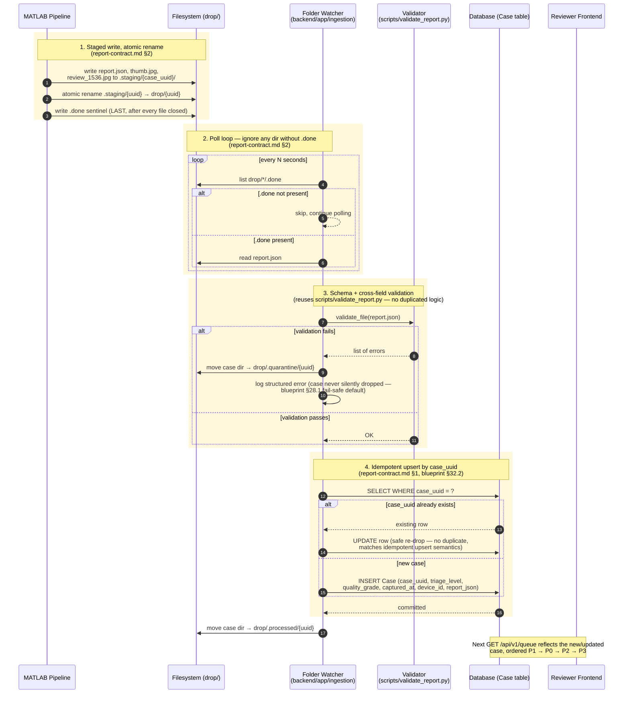

# Sequence Diagrams — Web Track

Implementation-level sequence diagrams for the flows that matter to the backend
(Nikhil) and frontend (Nitin) tracks. These are **not** a replacement for Ticket
A0's architecture diagram (`docs/architecture-diagram.md`, still to be produced) —
A0 is the high-level actor/topology view; these are step-by-step implementation
guides for two specific flows.

**Sourcing discipline:** every design decision below cites its source — either the
SIH blueprint (75-section document) or a file already in this repo. Nothing here
is invented; it's synthesis of what's already been decided.

**Scope decision (confirmed 2026-08-26):** no Redis, no outbox pattern, no
external notification channel (WhatsApp/SMS/etc.) for the web-track MVP. Matches
the SIH blueprint's own overengineering guardrail (§64) and the plan's existing
scope cuts — a single-writer SQLite/Postgres database with `case_uuid` as a
unique constraint is sufficient idempotency for hackathon scale (a few hundred
cases, one reviewer, one backend process). In-app worklist + dashboard only; no
push notifications.

---

## 1. Case Ingestion — MATLAB drop → Database

**Owner:** Nikhil (Ticket B2) · **Sources:** `docs/report-contract.md` §1–§2,
SIH blueprint §32.2 (idempotent sync), §8.1 (ingestion pipeline discipline),
§28.1 (fail-safe default — never silently drop a case), §54.1 (failure catalogue)



**What this diagram is testing (maps to B2's DoD):** dropping a fixture case
ingests it exactly once; re-dropping the same `case_uuid` updates rather than
duplicates; a malformed `report.json` is quarantined and logged, never silently
discarded.

---

## 2. Reviewer Adjudication — Worklist → Case Detail → Decision

**Owner:** Nitin (F1/F2/F3) + Nikhil (B3) · **Sources:** SIH blueprint §5.4
(Table 5.2, triage priority), §24.2 (three-layer explanation, one screen, no
click-through), §24.5 (reviewer screen design notes), §27.4 (reviewer decision
is authoritative and append-only — never overwrites the AI grade), §39.2
(worklist ordering), `docs/report-contract.md` §4

```mermaid
sequenceDiagram
    autonumber
    actor Dr as Doctor / Reviewer
    participant FE as React Frontend
    participant BE as FastAPI Backend
    participant DB as Database

    Dr->>FE: opens Worklist page
    FE->>BE: GET /api/v1/queue

    rect rgb(255, 248, 220)
    Note over BE,DB: 1. Priority ordering: P1 → P0 → P2 → P3<br/>(blueprint Table 5.2 — P0 sits SECOND, not last:<br/>an ungradeable image may be hiding advanced disease)
    BE->>DB: SELECT * ORDER BY triage_level (custom order), captured_at
    DB-->>BE: rows
    end

    BE-->>FE: 200 OK, cases[]
    FE-->>Dr: renders worklist (thumbnail, grade,<br/>confidence band, triage badge)

    Dr->>FE: clicks a case row
    FE->>BE: GET /api/v1/case/{case_uuid}
    BE->>DB: SELECT * WHERE case_uuid = ?

    alt case not found
        DB-->>BE: no row
        BE-->>FE: 404
    else case found
        DB-->>BE: full report_json
        BE-->>FE: 200 OK, case detail

        rect rgb(255, 248, 220)
        Note over FE,Dr: 2. Three-layer explanation, one screen,<br/>no click-through (blueprint §24.2)
        FE-->>Dr: renders review_1536.jpg + grade +<br/>calibrated confidence + lesion counts +<br/>recommendation text + limits.not_assessed
        end

        alt quality.grade == "C" OR triage.abstained
            rect rgb(255, 248, 220)
            Note over FE,Dr: 3. Never infer absence from silence<br/>(blueprint §22.3 / §24.6)
            FE-->>Dr: shows quality.reason and/or<br/>escalation_rules_fired explicitly — not a blank state
            end
        end
    end

    Dr->>FE: clicks Agree / Disagree / Regrade / Ungradeable
    FE->>BE: POST /api/v1/case/{case_uuid}/review<br/>{decision, reviewer_id, decision_uuid}

    rect rgb(255, 248, 220)
    Note over BE,DB: 4. Idempotent on decision_uuid<br/>(same idempotency pattern as case_uuid, report-contract.md §1)
    BE->>DB: SELECT WHERE decision_uuid = ?
    alt decision_uuid already exists
        DB-->>BE: existing row
        BE-->>FE: 200 OK (no-op, retry-safe)
    else new decision
        rect rgb(255, 248, 220)
        Note over BE,DB: 5. Reviewer decision is APPENDED, never overwrites<br/>the AI prediction (blueprint §27.4 — both stay available<br/>for analysis; reviewer grade is authoritative for the<br/>patient outcome, but the AI grade is retained alongside it)
        BE->>DB: INSERT ReviewDecision (append-only)
        end
        DB-->>BE: committed
        BE-->>FE: 200 OK
    end
    end

    FE-->>Dr: case marked reviewed, queue advances
    FE->>BE: GET /api/v1/queue (refresh)
    BE-->>FE: updated queue (case reprioritized/removed)
```

**What this diagram is testing (maps to F1/F2/F3/B3's DoD):** queue order is
exactly P1→P0→P2→P3; the case detail screen never makes the reviewer click
through to find evidence; a Grade-C or abstained case always shows *why*; a
resubmitted review decision (network retry) never creates a duplicate or
double-counts.

---

## What's deliberately absent from both diagrams

Per the scope decision above, and matching SIH blueprint §64 (Overengineering
Control) and §49.2 ("what is explicitly not in the stack"):

- **No Redis** — a DB-level unique constraint on `case_uuid` / `decision_uuid`
  is sufficient idempotency at this scale. Revisit only if measured contention
  ever shows a problem, not preemptively.
- **No outbox/event-bus pattern** — one backend process, one database. The
  "event" *is* the database write; there's no second system to keep in sync.
- **No external notification channel** — in-app worklist and dashboard only.
  Blueprint §29.1 already states external notifications are report/queue-first,
  only-if-stable, specifically to avoid live-service demo fragility.

If any of these get added later (multi-site V1, concurrent reviewers), it's a
new decision to make deliberately then — not something to build ahead of need.
